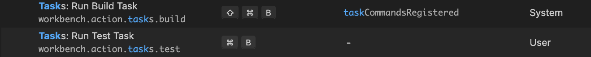

## 본 내용은 macOS 기준으로 작성 되었습니다.

### 환경
***macOS***

### vscode
- #### 키보드 셋팅
  
  각각 빌드와, 실행 단축키 셋팅입니다.
- #### Extention [C/C++](https://code.visualstudio.com/docs/languages/cpp)
- #### [task.json](#./task.md)
- #### [launch.json](#./launch.md)
  
### clang-format
- #### [clang format](#./clangformat)